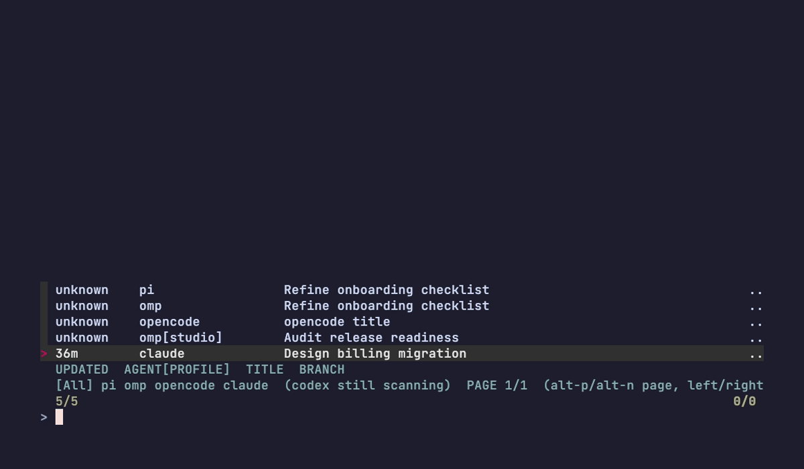
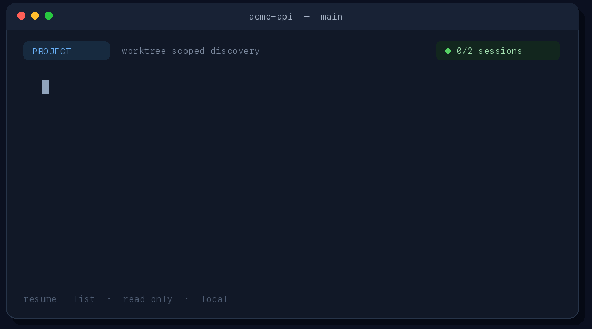

# resume

**One terminal picker for every coding-agent session in your project.**

Switch between Pi, Claude Code, Codex, OMP, and OpenCode sessions from a single fuzzy-filter interface — no per-agent commands, no machine-wide scans, no session rewrites. Select a session and `resume` hands it back to the agent's own native resume.


| Capability | Detail |
|---|---|
| Agents | Pi · Claude Code · Codex · OMP · OpenCode |
| Scope | Git worktree (default), explicit directory distance, or linked worktrees |
| Output | Interactive picker, `--list` text, `--json` machine-readable |
| Safety | Read-only discovery; no migration, no session rewrite, no telemetry |
| Platform | macOS and Linux (Homebrew tap or Cargo) |

## Install

### Homebrew (recommended)

```sh
brew install luw2007/tap/resume
```

The tap installs a prebuilt binary and shell completions on macOS or Linux.

### Cargo

Rust 1.91 or newer is required:

```sh
cargo install --git https://github.com/luw2007/resume --features opencode
```

The `resume` crate is not currently published to crates.io. GitHub Releases also provide prebuilt archives for macOS and Linux.

---

### Cross-agent discovery

This example shows Pi, OMP, OpenCode, and Codex sessions in one project-scoped view as discovery results arrive.



### Project-scoped filtering

Sessions are scoped to your current worktree by default. Use `--up` / `--down` for explicit directory distance, `--all-worktrees` for linked trees, or `--since` to filter by activity window.



### Preview and native resume

Toggle Preview with Ctrl-O to inspect session metadata before resuming. Selection triggers the agent's own native resume command in its recorded workspace, preserving supported root/profile overrides.


## Quick start

```sh
resume                         # picker for the default Scope
resume /path/to/worktree       # derive Scope from another directory
resume --list                  # stable text listing after discovery completes
resume --json                  # machine-readable v1 output
resume -a pi -a codex          # replace the configured agent list
resume --since 7d              # only Sessions active in the last 7 days
resume --since 2026-01-01      # only Sessions active on or after a date
resume --since all             # no time filtering (default)
```

The interactive picker opens after Pi, Claude, and OMP discovery completes; when configured alongside another agent, Codex continues scanning in the background and appears on its tab after the next navigation. It starts on the newest page of the `All` tab; selection remains attached to an opaque Session identity rather than a visual row index, so the result is stable even as background items arrive.

## Scope and Directory Distance

A **Workspace** is the directory recorded by an agent for a Session. A **Scope** is the set of Sessions considered for listing; `resume` reads only the known Session roots of enabled integrations and filters their recorded Workspaces. It does not recursively search the machine, unrelated sibling trees, or arbitrary directories for transcripts.

### Default Scope

Inside Git, the default Scope includes Workspaces at any depth in the current worktree. Use `--all-worktrees` to include linked worktrees too. A distinct nested repository is excluded.

```text
/repo                 included
/repo/services/api    included
/linked-worktree      included only with --all-worktrees
/repo/vendor/other    excluded when it is a distinct nested repository
/unrelated            excluded
```

Outside Git—or if Git Scope discovery fails—the fallback is the exact real base directory only, not its children. A Git failure is reported as a diagnostic.

### Explicit direction

`-U/--up` and `-D/--down` are mutually exclusive and override the Git default. **Directory Distance** counts real path-component edges in one direction:

```sh
resume --up 0          # current real directory only
resume --up 2          # current directory and at most two ancestors
resume --up all        # current directory through filesystem root
resume --down 0        # current real directory only
resume --down 2        # current directory and descendants at most two edges deep
resume --down all      # every descendant of the current directory
```

Upward Scope never includes children; downward Scope never includes ancestors or siblings. At `/`, `--down all` covers all descendants and is therefore broad, but it is still a directory-derived Scope rather than a separate machine-wide mode. Input paths are canonicalized, so symlinks use their real targets; a missing base directory is a usage error. Sessions whose recorded Workspace no longer exists may be diagnosed as unavailable and cannot be resumed.

## Picker and Preview

The Skim picker starts with Preview hidden unless config says otherwise.

| Key | Behavior |
|---|---|
| `Ctrl-O` | Toggle Preview |
| `Ctrl-R` | Intentionally ignored |
| `Alt-P` / `Alt-N` | Move to the older / newer page in the current tab |
| `Alt-Left` / `Alt-Right`, `Left` / `Right`, `Tab` / `Shift-Tab` | Move to the previous / next tab, wrapping and opening its newest page |
| `Esc` | Cancel without resuming |
| `Ctrl-C` | Interrupt (exit 130) |
Preview uses a safe dual-section fallback: normalized and raw-but-terminal-safe sections are shown together. **Ctrl-R does not reload, refresh, or switch views live.** A channel-fed Skim `reload` can execute its default filesystem command, so `resume` explicitly binds Ctrl-R to `ignore` to prevent an accidental filesystem listing. Preview currently presents the Session metadata/title available to the assembled picker; integration parsers and text-safety foundations have broader user-input coverage, but this README does not claim a full native transcript viewer.

## List and JSON output

```sh
resume --list
resume --json
resume /path/to/repo --json -a claude -a codex
```

`--list` waits for discovery, sorts the collected Sessions deterministically, and prints one terminal-safe row per Session: `UPDATED AGENT[PROFILE] TITLE BRANCH`. `UPDATED` uses the agent-native Session timestamp with a session-file modification-time fallback and renders as a human-relative date. `BRANCH` identifies the recorded Workspace worktree; detached and non-Git workspaces render `detached` and `no-branch`. Non-resumable rows append their support state (`[DiscoverOnly]`, `[Unavailable]`, or `[Unsupported]`); the picker Preview also shows `SUPPORT`. `--json` writes exactly one JSON document to stdout. Diagnostics go to stderr, so stdout can be piped safely:

```sh
resume --json 2>resume.errors | jq '.sessions[] | {agent, id, workspace}'
```

The v1 envelope is:

```json
{"schemaVersion":1,"sessions":[],"errors":[]}
```

Session objects contain `agent`, `profile`, `id`, `title`, `workspace`, `support`, `activity`, and `risk`. Error objects contain only `category` and `count`. JSON output never includes a `messages` array or full/raw transcript content. A Session `title` may intentionally contain a bounded, truncated summary excerpt derived from the first user message (or an explicit native title), so treat titles as potentially conversation-derived text. See [`docs/json-schema.md`](docs/json-schema.md) for the complete schema and serialization notes.

## Configuration

Agent selection is initialized separately in `~/.resume/settings.json`. On the first run, `resume` opens a terminal chooser; rerun it with `resume setup` to replace the saved list. `-a/--agent` overrides the saved selection, and `agents` in the selected TOML config overrides it when `-a` is absent. If neither configuration nor `-a` is present, a noninteractive first run exits with a setup hint instead of silently scanning nothing. By default, `resume` reads `~/.resume/config.toml`:

```sh
resume config path             # print active config file path
resume config example          # print a complete annotated example
```

Override with `RESUME_CONFIG=<path>` and invalid values are rejected. Print a complete example with:

```sh
resume config example
```

```toml
agents = ["codex", "claude", "pi", "omp", "opencode"]
since = "all"                    # duration (7d, 2h, 30m, 1w) | YYYY-MM-DD | all
confirm_always = false
preview = "hidden"               # hidden | visible
preview_position = "auto"        # auto | right | bottom
verbose = false
```

A repeatable `-a/--agent <AGENT>` replaces, rather than extends, the configured `agents` list. `--confirm-always` requests confirmation for every Resume. `--no-confirm` suppresses ordinary confirmation but cannot bypass a risk prompt. CLI `--verbose` enables verbose diagnostics.

`--since <duration|date|all>` filters Sessions to those active at or after a cutoff, overriding a configured `since` the same way `--agent` overrides `agents`. A relative duration is `<N>` followed by `m` (minutes), `h` (hours), `d` (days), or `w` (weeks); an absolute cutoff is `YYYY-MM-DD` (UTC midnight); `all` (the default) applies no filtering. The cutoff compares against each Session's best-available activity signal, falling back to the transcript file's own modification time when no other signal is available — this is Discovery-time filtering, not a claim that every agent's own activity timestamp is used.

## Native Resume boundary

After selection, `resume` restores the terminal, looks up the structured Session by opaque key, revalidates launch evidence, changes to the recorded Workspace, and uses discrete program/argv/environment values—never a shell command string.

| Agent | Native invocation constructed by the integration | Isolation preserved when applicable |
|---|---|---|
| Pi | `pi --session <absolute-jsonl-path>` | custom `--session-dir`; never `--session-id` |
| Claude Code | `claude --resume <uuid>` | nondefault `CLAUDE_CONFIG_DIR` |
| Codex | `codex -C <workspace> resume <uuid>` | nondefault `CODEX_HOME` |
| OMP default profile | `omp --resume <id>` | config/root environment and custom `--session-dir` for alternate profiles |
| OpenCode | `opencode --dir <workspace> resume <id>` | None beyond workspace |

Resume invocation is deterministic: for a given Session state the constructed argv is always the same. `resume` does not inject environment variables beyond those strictly required by the integration and reproduces each agent's native title-ranking behavior.

## Support list

"Supported" below means the corresponding integration tests prove that capability. Active detection is positive-evidence-only: failure to prove Active remains `Unknown`, never `Inactive`. The assembled app currently supplies no live-correlation evidence to Pi, so Pi Sessions remain `Unknown`. Claude Sessions also report `Unknown`. Codex Sessions report `Active` only when one process-wide `lsof` probe finds a live Codex process holding the exact rollout file open. OMP correlates one read-only process snapshot with its per-profile terminal breadcrumbs.

OpenCode support is compiled in only with `cargo build --features opencode` (it depends on SQLite, unlike every other integration); a plain `cargo build` runs without it and `-a opencode` reports `opencode_disabled`. A build that does have the feature but finds no database reports `opencode_root_unavailable` instead, so the two are distinguishable: the first is fixed by rebuilding, the second is not.

| Agent | Discovery | Preview parsing | Exact Resume | Profiles | Active Detection |
|---|---|---|---|---|---|
| Pi | Supported | Supported | Supported | Not applicable | Conditional: validated ID + Session path evidence; Unknown by default |
| Claude Code | Supported | Supported | Supported | Not applicable | Unknown (no proven correlation) |
| Codex | Supported | Supported | Supported | Not applicable | Supported: one `lsof` probe per run; exact rollout path or confirmed device/inode evidence; Unknown otherwise |
| OMP | Supported | Supported | Supported | Supported | Supported: live OMP process + resolved TTY + matching existing per-profile breadcrumb |
| OpenCode | Supported (requires `--features opencode`) | Title only (no message-content extraction) | Supported | Not applicable | Unknown (no proven correlation) |

Preview parsing here means read-only extraction and terminal-safe normalization are covered by integration/foundation tests. It does not promise native title precedence or a full transcript in the current production picker. Set `RESUME_DISABLE_PROC_PROBE` to any value to disable process probing and force positive-evidence activity detection to fall back to `Unknown`.

## Privacy and diagnostics

- Discovery and Preview do not modify Session files, indexes, databases, mtimes, or directory entries.
- No telemetry is collected.
- Full message bodies and raw transcript content are not logged and are never included as a `messages` array in JSON output. A Session `title` may intentionally include a bounded, truncated excerpt of the first user message.
- Normal diagnostics contain redacted categories and counts. `--verbose` may add source paths and error chains to **stderr**, but still does not log full message bodies or sensitive remotes/URLs.
- Preview and list text neutralize terminal control sequences; raw Preview remains terminal-safe.
- There is no persistent Preview cache and no machine-wide scan.

If one integration fails, the others can still return Sessions; failures are isolated and summarized. Use `resume --verbose --list` or `resume --verbose --json` when diagnosing discovery.

## Shell completions

Generate Bash, Zsh, or Fish completion scripts with the built-in subcommand:

```sh
resume completions bash
resume completions zsh
resume completions fish
```

Installation examples and the repository-generated scripts are documented in [`docs/completions.md`](docs/completions.md). Completion generation dispatches before application startup, so it does not load configuration or discover/scan Sessions.

## License

MIT
