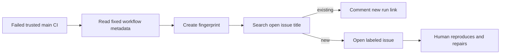

# Disposable CI-failure Issue experiment

## Status

Planning only. This experiment must be cheap to delete: one workflow and two labels. It creates no repair code, custom Rust module, ledger, agent runner, PR, merge, publish, or release authority.

## Question

Can failed trusted `main` CI runs create useful, deduplicated, redacted Issues without human monitoring of Actions?

The experiment does **not** answer whether an agent should repair code automatically. A maintainer remains responsible for reproduction and every repair PR.

## Existing signal

`.github/workflows/ci.yml` already runs `make ci`'s constituent quality checks on `main`, pull requests, and a weekly schedule. It has `contents: read` only. The bug form already excludes session transcripts, credentials, tokens, private keys, and private remote URLs.

## One interface

```text
observe(failed_trusted_main_ci_run) -> open_or_comment_issue
```

Input is fixed GitHub `workflow_run` metadata for the existing `CI` workflow. The workflow does not check out source, download artifacts, parse raw logs, or execute any command from an Issue, log, or model response.

A deterministic fingerprint contains only:

```text
CI workflow name + head SHA + failed job name + failed step name
```

The workflow searches for an open Issue whose title contains that fingerprint. It opens one if absent, otherwise comments with the new Actions-run link.

## Issue contents

The fixed Issue body contains only:

- fingerprint;
- immutable commit SHA;
- workflow, job, and step names;
- run URL;
- fixed local reproduction identifier: `make ci`.

Raw logs remain in GitHub Actions. They are never copied into Issues. No runner workspace path, environment variable, session data, URL from a log, or arbitrary output is persisted.

## Trust and permissions

- Trigger: completed `workflow_run` for `CI`, plus controlled `workflow_dispatch` validation.
- Filter: failed conclusion and `main` head branch only. Pull-request and fork runs are ignored.
- Permissions: `contents: read`, `issues: write` only.
- No secrets, `pull_request_target`, checkout, artifact access, release permissions, PR permissions, or workflow-write permissions.
- The workflow only applies `automation:ci-failure` and `needs-human-triage` labels.

## Flow



## Acceptance

Observe for two weekly CI cycles:

1. each qualifying failure creates exactly one Issue;
2. repeated failures comment on the same Issue;
3. no Issue carries raw log text or private/sensitive data;
4. the workflow cannot modify source or create a PR;
5. the Issue links a run a maintainer can inspect and names `make ci` as reproduction.

## Delete criteria

Delete the workflow and labels if it produces duplicate/noisy Issues, lacks actionable context, or yields no human-triaged Issue across two weekly cycles. There is no retained application state to migrate.

## Explicitly deferred

- repair agents and draft repair PRs;
- deduplication database/ledger;
- dependency, security, release, flaky PTY, and external-agent compatibility repair;
- observing user-created Issues automatically.
