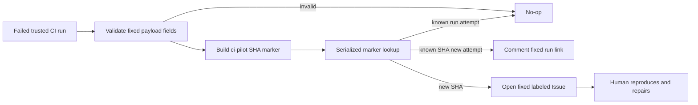

# Disposable CI-failure Issue experiment

## Status

Planning only. This is intentionally **not** an automatic-repair system. It is a two-week test of whether GitHub Actions failure metadata is useful enough to route a maintainer to an actionable problem.

The implementation, if enabled, is one workflow and two manually-created labels. It creates no Rust code, action, composite action, database, ledger, artifact, agent runner, repair branch, PR, merge, publish, or release authority.

## Decision

Start only if the maintainer accepts that GitHub Issues/comments are durable public records: deleting the workflow and labels cannot erase notifications, caches, or Issue history. If that is unacceptable, do not run the experiment.

A successful two-week notifier pilot is a prerequisite for any later, separately designed repair-PR pilot. It does not authorize one.

## Existing signal

`.github/workflows/ci.yml` already runs deterministic quality checks on `main` and weekly schedule. `Makefile` defines `make ci` as the local aggregate quality command. Existing bug intake already prohibits session transcripts, credentials, tokens, private keys, and private remote URLs.

## Exact interface

```text
observe(failed trusted CI workflow_run) -> create or comment one Issue
```

The notifier reads **only validated run-level primitives from the `workflow_run` payload**:

- 40-character lowercase `head_sha`;
- numeric run ID and run attempt;
- `head_branch`;
- upstream event name;
- failed conclusion;
- same-repository identity.

It must not fetch Actions jobs, steps, logs, artifacts, caches, source, or event-derived files. It must not inspect or execute repository code.

The fingerprint is deliberately narrow and honest:

```text
ci-pilot:<head_sha>
```

It deduplicates reruns and multiple failing jobs for the same commit. It does **not** claim to identify a root cause across commits. A new failing `main` commit may create a new Issue; the pilot has a pre-agreed hard Issue budget and stops at the first unacceptable burst.

## Eligibility gate

Before writing an Issue, the one job must validate all of:

1. `workflow_run.conclusion == 'failure'`;
2. upstream workflow identity is the existing exact `CI` workflow;
3. `head_branch == 'main'`;
4. payload repository and head repository both equal the current repository;
5. upstream event is exactly `push` or `schedule`.

Any absent or unexpected field is a no-op. Pull-request, release, and manually dispatched CI runs are out of scope. The notifier itself has no `workflow_dispatch` input: arbitrary run selection would require an extra trust and API path.

## Issue and comment payload

The Issue title includes the exact opaque marker `[ci-pilot:<head_sha>]`. The fixed body contains only:

- the marker;
- the validated SHA;
- numeric run ID and attempt;
- a run URL constructed from fixed repository identity plus numeric run ID;
- fixed prose: `Maintainer starting point: make ci; reproduction not yet confirmed.`

The workflow never copies job/step names, raw logs, artifacts, environment values, runner paths, URLs from payloads, commit messages, actor data, source content, or user-generated Issue content. Existing bot comments are matched by an exact fixed run-attempt marker; repeat delivery becomes a no-op.

## Security envelope

```yaml
permissions:
  contents: read
  issues: write
```

- `workflow_run` runs from the default branch with a potentially write-capable token. Its safety derives from no checkout, artifact/log/cache access, source/script execution, secrets, or dynamic shell code.
- No `actions: read`, `pull-requests`, `contents: write`, release, package, OIDC, deployment, workflow-write, or security permission.
- No `pull_request_target`, third-party action, external service, agent/model, `eval`, or command assembled from event data.
- GitHub API calls are limited to listing bounded labeled Issues, creating an Issue, and commenting on one. API JSON/body construction uses fixed templates and JSON encoding, never interpolated shell source.
- Workflow-level concurrency serializes by repository ID plus validated head SHA. Existing markers are checked across open **and closed** pilot Issues; the notifier never reopens, assigns, mentions, labels beyond the two pilot labels, or closes an Issue.

## Minimal state and deletion

Before activation, a maintainer manually creates only:

- `automation:ci-failure`;
- `needs-human-triage`.

The workflow fails closed if either label is absent. It never creates labels.

Deletion procedure after the fixed fourteen-day window:

1. remove `.github/workflows/ci-failure-issue.yml`;
2. remove both labels;
3. use a maintainer-held list of pilot Issue URLs to delete Issues/comments where policy permits, otherwise close them with a fixed pilot-removal note;
4. accept that GitHub notification/audit history may remain.

No repository data migration exists because the pilot writes no repository state.

## Flow



## Two-week acceptance and stop rules

Before enabling, the maintainer records outside the repository: owner, start/end date, maximum Issue/comment budget, and the pilot Issue URL list.

The pilot is successful only if:

1. same SHA creates at most one Issue;
2. a new run attempt comments at most once on that Issue;
3. no Issue stores raw CI log or sensitive data;
4. no workflow run modifies source or creates a PR;
5. at least one human finds a generated Issue useful enough to inspect the linked run.

Stop and delete immediately on: a duplicate, privacy incident, unexpected downstream Issue automation, budget breach, need for logs/artifacts/checkout/broader permissions, or no useful human-triaged Issue by the deadline.

## Explicitly deferred

Automated repair, draft PRs, code agents, custom source modules, durable ledgers, cross-commit root-cause deduplication, user-Issue ingestion, dependency/security/release repair, flaky PTY diagnosis, and external-agent format compatibility repair.
